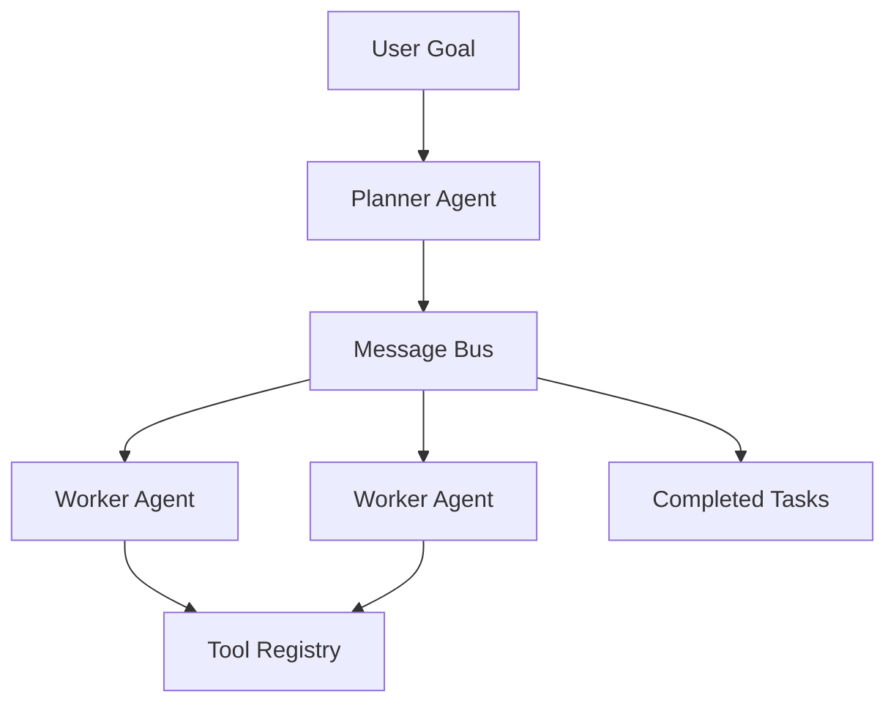

# Multi-Agent Orchestrator

[](https://www.python.org/)
[](LICENSE)

Coordination framework for autonomous AI agents with task decomposition, tool use, and async inter-agent messaging. A minimal but extensible foundation for building multi-agent systems.

## Architecture



| Component | Role |
|-----------|------|
| **Planner** | Decomposes goals into subtasks |
| **Workers** | Execute subtasks using registered tools |
| **Message Bus** | Async pub/sub between agents |
| **Tools** | Pluggable capabilities (search, code, APIs) |

## Quick start

```bash
python -m venv .venv && source .venv/bin/activate
pip install -r requirements.txt
make demo
```

Example output:

```json
[
  {"from": "worker-1", "task": "Research: distributed consensus", "result": "[search results...]"},
  {"from": "worker-1", "task": "Analyze findings for: distributed consensus", "result": "completed: ..."},
  {"from": "worker-1", "task": "Write summary of: distributed consensus", "result": "completed: ..."}
]
```

## Usage

```bash
python -m orchestrator run --goal "Research and summarize distributed consensus"
```

## Extending with custom tools

```python
from orchestrator.engine import Orchestrator
from orchestrator.agents.worker import WorkerAgent

async def my_tool(task: str) -> str:
    return f"processed: {task}"

orch = Orchestrator()
orch.worker.tools["custom"] = lambda q: my_tool(q)
```

## Project layout

```
orchestrator/
  bus.py              Async message bus
  engine.py           Orchestration loop
  agents/
    planner.py        Goal → subtask decomposition
    worker.py         Task execution with tools
    base.py           Agent interface
  tools/
    search.py         Web search tool stub
```

## Development

```bash
make install   # venv + deps
make demo      # run sample goal
make test      # unit tests
```

## Roadmap

- [ ] Supervisor agent for failure recovery
- [ ] LLM-backed planner (OpenAI / local models)
- [ ] Persistent message history

## License

MIT — see [LICENSE](LICENSE).
